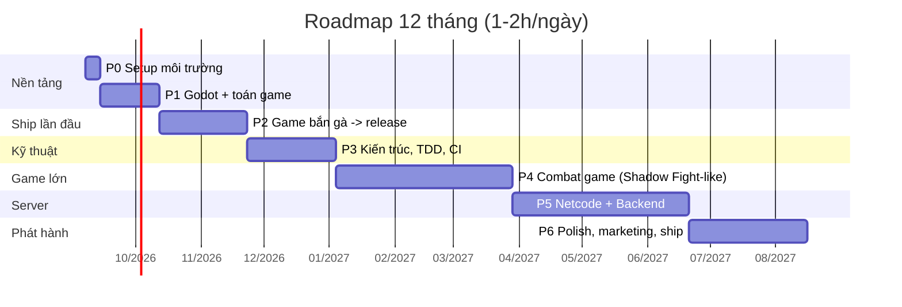

# 00 — Tổng quan lộ trình 12 tháng

## 1. Điểm xuất phát và điểm đến

**Bạn đang có (tài sản thật, đừng đánh giá thấp):**
- Tư duy lập trình vững, quen C/C++, JS/TS, Python, Bash
- Git/GitHub, VS Code, Docker — tức là đã có sẵn nửa phần "kỹ thuật phần mềm" mà đa số người học làm game thiếu
- Linux/CLI thành thạo → build pipeline, CI, server backend sẽ rất dễ với bạn

**Bạn đang thiếu (đây là nội dung thật của roadmap này):**
- Game feel / game design — vì sao một game *vui*
- Vòng đời game loop, kiến trúc scene/entity, state machine cho gameplay
- Toán ứng dụng: vector, va chạm, nội suy, easing
- Art & audio pipeline ở mức "đủ dùng"
- Kỷ luật **hoàn thành và phát hành** một sản phẩm nhỏ

**Đích sau 12 tháng:**
- 3 game đã phát hành công khai (itch.io), trong đó 1 game combat có chiều sâu
- 1 backend game server có xác thực, leaderboard, cloud save, chạy trong Docker
- 1 prototype multiplayer real-time hoạt động qua Internet
- Portfolio GitHub với devlog 48 tuần + postmortem

---

## 2. Bản đồ 6 giai đoạn

| GĐ | Tuần | Chủ đề | Sản phẩm bắt buộc (Deliverable) |
|----|------|--------|--------------------------------|
| **P0** | 0 | Dựng môi trường, quy trình | Repo có CI, Godot chạy, docs/ đầy đủ |
| **P1** | 1–4 | Godot fundamentals + toán 2D | 4 micro-prototype (Pong, Breakout, Top-down, Platformer) |
| **P2** | 5–10 | Game hoàn chỉnh #1 — shmup "bắn gà" | Build Linux + Web, **đã publish itch.io**, có menu/save/audio |
| **P3** | 11–16 | Software engineering cho game | Thư viện tái sử dụng có unit test + CI + profiling report |
| **P4** | 17–28 | Game hoàn chỉnh #2 — combat 2D | Game combat có 3 enemy, 1 boss, progression, **publish** |
| **P5** | 29–40 | Server-side game dev | Backend Node/TS + Postgres + Docker, và prototype multiplayer |
| **P6** | 41–48 | Ship & grow | Trang store hoàn chỉnh, devlog công khai, postmortem, kế hoạch năm 2 |

---

## 3. Phân bổ thời gian trong tuần (khuôn mẫu đề xuất)

Với 1–2h/ngày, đừng chia đều. Chia theo **loại năng lượng**:

| Ngày | Thời lượng | Loại việc | Lý do |
|------|-----------|-----------|-------|
| T2 | 1h | Học lý thuyết (video/docs) + ghi chú | Đầu tuần não còn tải được kiến thức mới |
| T3 | 1.5h | Code feature chính | Khối làm việc sâu nhất |
| T4 | 1.5h | Code feature chính (tiếp) | Giữ đà, tránh mất context |
| T5 | 1h | Bug fix + viết test | Việc nhỏ, dễ hoàn thành khi mệt |
| T6 | 1.5h | Code feature phụ / polish / juice | Việc "vui", giữ động lực cuối tuần |
| T7 | 2h | Khối lớn: art, audio, build, hoặc feature khó | Ngày rảnh nhất |
| CN | 0.5h | **Review + devlog + lên kế hoạch tuần sau** | Bắt buộc, không bỏ |

**Tổng: ~9h/tuần.** Nếu tuần nào hụt, cắt T6, không bao giờ cắt CN.

> Quy tắc 20 phút: nếu ngày nào thật sự kiệt sức, vẫn mở máy làm **đúng 20 phút** một việc nhỏ nhất (đổi một con số, sửa một sprite). Giữ chuỗi quan trọng hơn giữ tốc độ.

---

## 4. Ánh xạ từ 2 roadmap gốc

Hai roadmap của roadmap.sh viết cho người muốn xin việc studio. Bạn làm solo, nên tôi **cắt bỏ**, **hoãn lại** và **giữ lại** như sau:

### Từ `roadmap.sh/game-developer`

| Nhánh gốc | Xử lý | Lý do |
|-----------|-------|-------|
| Toán: Vector, Matrix, Linear Algebra | ✅ Giữ, nhưng chỉ 2D — P1 | Cần ngay cho chuyển động, va chạm |
| Toán: Quaternion, 3D transforms | ⏸ Hoãn sang năm 2 | Chỉ cần khi làm 3D |
| Physics: collision detection, rigid body | ✅ Giữ — P1/P2, dùng engine physics trước, hiểu sau | Tự viết physics là bẫy thời gian |
| Game Engine (Unity/Unreal/Godot) | ✅ Godot 4 — xem [01-tech-stack.md](01-tech-stack.md) | Phù hợp máy + solo + FOSS |
| Graphics API (OpenGL/Vulkan/DirectX) | ❌ Bỏ | Không cần cho game 2D bằng engine. Chỉ học **shader ngôn ngữ** (P3) |
| Shaders | ✅ Giữ ở mức ứng dụng — P3 | Hit flash, dissolve, outline — cực kỳ đáng giá về mặt "juice" |
| Design Patterns (State, Observer, Command, Object Pool, Component) | ✅ Giữ — P3, trọng tâm | Bạn đã biết pattern, chỉ cần học biến thể game |
| Gameplay Programming (AI, animation, input) | ✅ Giữ — P4, trọng tâm | Đây là phần "làm game" thật sự |
| Audio programming | ✅ Giữ ở mức API engine — P2 | Đủ để có game feel |
| Level/Content tools | ✅ Giữ — P3 (data-driven bằng JSON/Resource) | Sức mạnh lớn nhất của solo dev |
| Multiplayer/Networking | → Chuyển sang P5 | Xem roadmap server-side |
| Console SDK, AAA pipeline, C# job system | ❌ Bỏ | Không áp dụng cho solo indie |

### Từ `roadmap.sh/server-side-game-developer`

| Nhánh gốc | Xử lý | Giai đoạn |
|-----------|-------|-----------|
| Networking cơ bản: TCP vs UDP, latency, packet loss | ✅ Giữ | P5 tuần 29–30 |
| Protocol & serialization (JSON, MessagePack, Protobuf) | ✅ Giữ | P5 tuần 31 |
| Authoritative server, client prediction, reconciliation, interpolation | ✅ Giữ — phần lõi | P5 tuần 32–35 |
| Lockstep vs snapshot vs rollback | ✅ Học lý thuyết, implement 1 loại | P5 tuần 35–36 |
| Backend services: auth, profile, leaderboard, cloud save, matchmaking | ✅ Giữ — dễ nhất với bạn | P5 tuần 37–39 |
| Database (SQL + Redis) | ✅ Giữ: Postgres + Redis | P5 tuần 37 |
| DevOps: Docker, CI/CD, monitoring | ✅ Giữ — bạn đã có Docker sẵn | P5 tuần 39–40 |
| Anti-cheat, rate limiting, security | ✅ Giữ ở mức nguyên tắc | P5 tuần 40 |
| Scaling: sharding, k8s, load balancer, dedicated server fleet | ⏸ Chỉ đọc hiểu, không implement | Không có người chơi thì không cần scale |
| Live-ops, telemetry, A/B testing | ✅ Mức tối thiểu (analytics đơn giản) | P6 |

---

## 5. Cột mốc kiểm tra (bỏ qua = đi sai đường)

- **Cuối tuần 4:** 4 prototype chạy được, mỗi cái < 300 dòng. Nếu chưa xong → giảm scope, không kéo dài P1.
- **Cuối tuần 10:** Có link itch.io công khai gửi được cho bạn bè. **Đây là mốc quan trọng nhất của cả năm.**
- **Cuối tuần 16:** `godot --headless -s addons/gut/gut_cmdln.gd` chạy xanh trong GitHub Actions.
- **Cuối tuần 28:** Game combat publish, có ít nhất 5 người ngoài chơi và phản hồi.
- **Cuối tuần 40:** 2 client kết nối qua Internet, đánh nhau, server là trọng tài.
- **Cuối tuần 48:** Postmortem viết xong, kế hoạch năm 2 rõ ràng.

## 6. Cơ chế chống bỏ cuộc

| Rủi ro | Dấu hiệu sớm | Đối sách viết sẵn |
|--------|-------------|-------------------|
| Scope creep | "Thêm tính năng này nữa sẽ hay lắm" | Ghi vào `docs/devlog/backlog-icebox.md`, **không làm trong sprint hiện tại** |
| Chán vì art xấu | Né mở project | Dừng code 1 buổi, chỉ đi lấy asset đẹp free (Kenney) → game trông khác hẳn |
| Kẹt kỹ thuật > 3 ngày | Cùng một bug 3 buổi liên tiếp | Hỏi cộng đồng Godot Discord/r/godot, hoặc **đi vòng**: hack tạm, ghi TODO |
| Mất động lực giữa dự án lớn (P4) | Tuần 22–24 là vùng nguy hiểm nhất | Chèn 1 tuần "game jam" làm game rác 3 ngày để reset |
| Học mãi không làm | Xem video > code | Quy tắc 1:3 — 1 giờ học phải kèm 3 giờ code |
